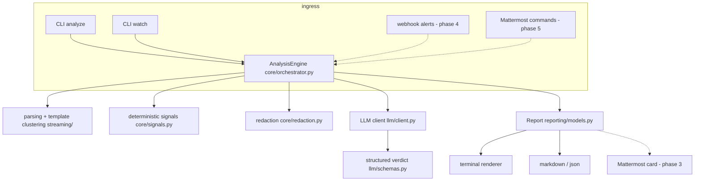

# AI Ops Agent

An LLM-driven ops assistant that analyzes logs, triages incidents, and watches
live streams. The CLI is a first-class entry point: given an Anthropic API key
and nothing else, `ai-ops analyze --source app.log` produces a structured
incident report. Cluster tools (VictoriaMetrics, Kubernetes, Mattermost) plug
into the *same* engine in later phases.

## Status — delivery phases

| Phase | Scope | Status |
|---|---|---|
| 1 | Core engine + `ai-ops analyze` (parsing, template clustering, signals, LLM verdict, terminal renderer) | ✅ implemented |
| 2 | `ai-ops watch` (streaming, baseline learning, trigger policy, cooldowns, session summary) | ✅ implemented |
| 3 | Mattermost outbound (cards, threading, channel routing, retry queue) | ✅ implemented |
| 4 | Reactive alert path (webhook ingest, dedupe, cluster tool layer, agent loop) | ⏳ next |
| 5 | Mattermost inbound (slash commands, buttons, feedback) | ⏳ |
| 6 | SSH diagnostic tool (allowlisted) | ⏳ |
| 7 | Night audit | ⏳ |
| 8 | Hardening (eval harness, Helm, dashboards) | ⏳ |

## Quickstart

```bash
pipx install .            # or: pip install .
export ANTHROPIC_API_KEY=sk-ant-...   # default provider
# or use OpenAI / any OpenAI-compatible endpoint (vLLM, Ollama, LiteLLM):
#   export OPENAI_API_KEY=sk-...
#   ai-ops analyze --source app.log --provider openai --model gpt-4.1
#   AI_OPS_LLM_OPENAI_BASE_URL=http://localhost:11434/v1 for self-hosted

ai-ops analyze --source app.log                 # full LLM-backed report
ai-ops analyze --source app.log --no-llm        # deterministic only, no key needed
cat /var/log/syslog | ai-ops analyze --no-llm   # stdin
ai-ops analyze --source "docker logs --tail 5000 my-api"
ai-ops analyze --source journalctl:nginx --since 1h

ai-ops watch "docker logs -f my-api"            # learn 5min baseline, then alert
ai-ops watch --source /var/log/app.log --baseline 60
```

Try it against the bundled samples:

```bash
make demo-cli
```

Exit codes: `0` clean, `1` findings at or above `--fail-on` (default `sev2`) —
usable as a CI gate, `2` tool/config error.

## Architecture



Critical invariant: **all entry points converge on the same engine and the
same `Report` model.** The CLI contains no analysis logic — it resolves
sources, wires the engine, and renders.

The model never sees the raw firehose: lines are parsed, clustered into
normalized templates (Drain-style), summarized into deterministic signals
(level histograms, error timelines, security-signal matches, exception types,
logging gaps), redacted, and only that compact summary is sent — wrapped in
untrusted-data delimiters with anti-hallucination rules that are also enforced
in code (every evidence excerpt must appear verbatim in the supplied context;
one retry, then degrade to deterministic output).

## Configuration

Precedence: real env vars > `.env` file (working directory or any parent, loaded automatically — see `.env.example`) > YAML (`--config file.yaml`) > defaults. The `.env` file also covers `ANTHROPIC_API_KEY` / `OPENAI_API_KEY`.

| Setting | Env var | Default |
|---|---|---|
| LLM provider | `AI_OPS_LLM_PROVIDER` | `anthropic` (`openai` for OpenAI or any OpenAI-compatible endpoint) |
| OpenAI base URL | `AI_OPS_LLM_OPENAI_BASE_URL` | `https://api.openai.com/v1` (point at vLLM/Ollama/LiteLLM for self-hosted) |
| OpenAI API key | `AI_OPS_LLM_OPENAI_API_KEY` (falls back to `OPENAI_API_KEY`) | — |
| Strong model | `AI_OPS_LLM_MODEL` | `claude-opus-5` |
| Fast model (classification, later phases) | `AI_OPS_LLM_FAST_MODEL` | `claude-haiku-4-5` |
| LLM context budget (chars) | `AI_OPS_LLM_MAX_CONTEXT_CHARS` | `60000` |
| Redaction on/off | `AI_OPS_REDACT` | `true` |
| Redact IPs too | `AI_OPS_REDACT_IPS` | `false` |
| Watch window | `AI_OPS_WATCH_WINDOW_SECONDS` | `60` |
| Watch baseline | `AI_OPS_WATCH_BASELINE_SECONDS` | `300` |
| Watch cooldown | `AI_OPS_WATCH_COOLDOWN_SECONDS` | `120` |
| Max alerts/hour | `AI_OPS_WATCH_MAX_ALERTS_PER_HOUR` | `10` |

YAML example:

```yaml
llm:
  model: claude-opus-5
watch:
  baseline_seconds: 120
redact: true
```

### Mattermost notifications (Phase 3)

Configure a bot account + Personal Access Token (preferred — enables
threading, in-place status updates, and file uploads):

```bash
export AI_OPS_MATTERMOST_URL=https://mattermost.example.com
export AI_OPS_MATTERMOST_TOKEN=xxxx          # bot PAT
export AI_OPS_MATTERMOST_TEAM=myteam
export AI_OPS_MATTERMOST_DEFAULT_CHANNEL=ops-alerts
export AI_OPS_MATTERMOST_NOISE_CHANNEL=ops-noise   # false_positive/noisy_rule land here

ai-ops analyze --source app.log --notify mattermost
ai-ops watch "docker logs -f api" --notify mattermost --channel ops-alerts
```

Incident posts are severity-colored cards (sev1 `#d24b4b` + `@here`, sev2
`#e8a33d`, sev3 `#4b8bd2`, info `#5a5a5a`) with the full markdown report as a
threaded file attachment. One investigation = one root post — repeat findings
(watch) thread under it. Messages over the 4000-char cap are split into the
thread; rate limits are honored with backoff; undeliverable posts persist to
`~/.ai-ops/mattermost-queue.jsonl` and are flushed on the next successful
delivery, so a Mattermost outage doesn't lose an incident.

`AI_OPS_MATTERMOST_WEBHOOK_URL` is a fallback for the simplest deployments —
note the feature loss: no threading, no message updates, no file uploads.

See [docs/cli.md](docs/cli.md) for the full command reference and
[SECURITY.md](SECURITY.md) for the threat model.

## Development

```bash
pip install -e ".[dev]"
make test     # pytest
make lint     # ruff + mypy
```

Environment assumptions (the implementation prompt's fill-in block, defaults
chosen for v1): Anthropic API as the LLM provider; English reports; redaction
on by default so log content can leave the perimeter safely; local workloads =
files, docker logs, journalctl. Python 3.11+ (spec prefers 3.12; 3.11 is kept
in range so current LTS distros work).
